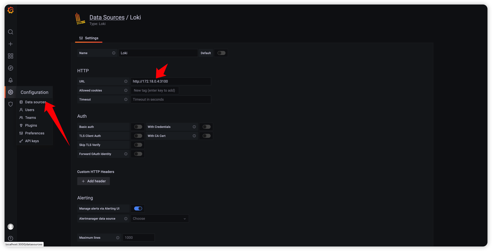
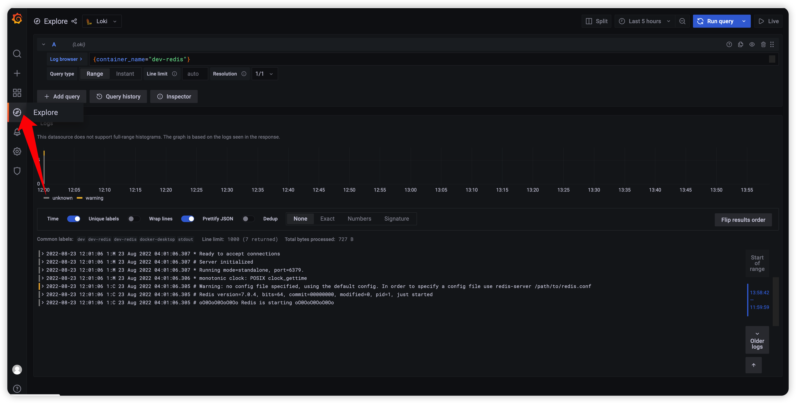

- 日志平台是云原生生态中不可或缺的一个体系,在CNCF官方生态图中位于OBSERVABILITY& ANALYSIS即可观测和分析,所以日志平台的搭建对于开发运维都有很重要的意义

-

常见的日志采集工具有Logstash、Filebeat、Flume、Fluentd、Logagent、rsyslog等,本项目采用Fluentd和Loki两种方式,实际生产环境和公司实际情况也尽不相同,更多的是入门云原生日志平台,浅窥云原生基础组件,因为在云原生环境下或开源或公司自建的平台数不胜数,对于开发者的挑战是快速适应组件基本使用和适应的能力,了解其中一个组件核心流程其它组件也可触类旁通,具体各工具适用场景及优缺点不在本项目赘述

- docker-compose中如果所有容器都正常启动登录kibana创建fluentd-*索引模式(所有容器都正常启动情况下会有此索引模式)
  

- 进入Discover面板,同时访问[dev-web](http://localhost:1080/)即可看到项目日志
  

- 以下介绍Loki方式收集docker容器日志
    1. 安装docker插件
   ```
    docker plugin install grafana/loki-docker-driver:latest --alias loki --grant-all-permissions
   ```
    2. 重启docker,配置etc/docker/daemon.json,windows和mac通过desktop配置
   ```
    "log-driver": "loki",
    "log-opts": {
        "loki-url": "http://localhost:3100/loki/api/v1/push",
        "max-file": "10",
        "max-size": "50m"
    },
   ```
    3. 删除dev-redis或者新启动任何一个测试容器即可进入grafana看到日志信息,因为在此处loki插件只会收集安装完自身之后所创建容器的日志数据
    4. 配置grafana数据源为Loki,注意ip地址通过portainer查看loki具体容器ip,原因可能在于mac环境与linux
       docker底层network实现有细微差别,Windows暂未测试,可先用localhost测试是否可连
       
    5. 进入explore面板查看容器日志,此项目不会深入教学各种组件操作教程和语法教程
       

- grafana监控nacos_monitor
    1. 添加prometheus数据源
       
    2. 导入nacos监控配置文件
       
    3. 进入dashboard面板查看nacos监控信息
       
