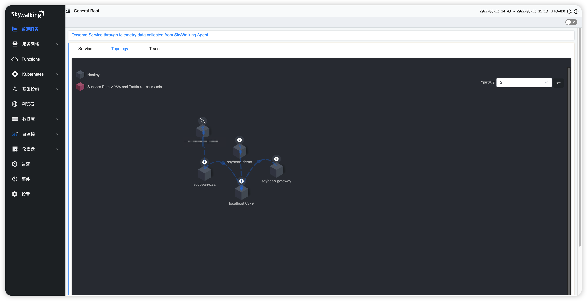

- 服务代理、发现和治理
  ###### 在容器微服务的基础上，通过Service Mesh可以让用户更精细、更智能的去管理服务之间的通讯,代表作LINKERD,Istio,Consul等,本项目skywalking理论上只是其中一个知识点,一般常用于链路追踪不能等同于Service Mesh,同类产品jaeger,zipkin

- idea中接入skywalking
  ```
  -javaagent:/skywalking-agent.jar
  -DSW_AGENT_NAME=soybean-demo
  -DSW_AGENT_COLLECTOR_BACKEND_SERVICES=localhost:11800
  ```

- 登入skywalking控制台
  